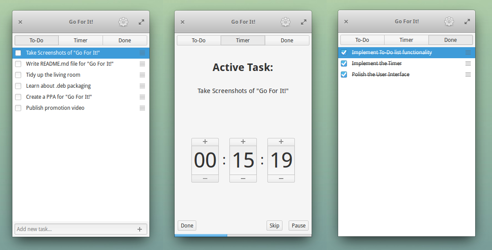

# Information for End Users

_Go For It!_ is a simple and stylish productivity app, featuring a to-do list, merged with a timer that keeps your focus on the current task. More information for end users can be found [here](http://manuel-kehl.de/projects/go-for-it).

## How To

The following video explains the workflow of *Go For It!*:

## Storage and Synchronisation

To-do lists are stored in the [Todo.txt](http://todotxt.com/) format. This simplifies synchronization with mobile devices and makes it possible to edit tasks using other Todo.txt front-ends (e.g. the official apps for [Android](https://play.google.com/store/apps/details?id=com.todotxt.todotxttouch&hl=en) or [iOS](https://itunes.apple.com/us/app/todo.txt-touch/id491342186?ls=1&mt=8) or the alternative Android client [Simpletask](https://play.google.com/store/apps/details?id=nl.mpcjanssen.todotxtholo&hl=en)).
A comprehensive tutorial about setting up *Go For It!* with *Simpletask* can be found [here](http://itsfoss.com/go-for-it-to-do-app-in-linux/).

If you already use Todo.txt, **beware** of the fact, that *Go For It!* automatically archives completed tasks to the done list!

## Download and Installation

I maintain a [Launchpad PPA](https://launchpad.net/~mank319/+archive/ubuntu/go-for-it) which can be used to acquire .deb packages. On Ubuntu (+ derivates) it is recommended to add the PPA for automatic updates:

    sudo add-apt-repository ppa:mank319/go-for-it && sudo apt-get update 
    sudo apt-get install go-for-it
    
Arch Linux:

    yaourt -S go-for-it-git

The Windows version is available for download [here](http://manuel-kehl.de/projects/go-for-it/download-windows-version).

An OSX Version may follow in the future.

## Donations

If you like _Go For It!_ and want to support its development, I'd very much appreciate a little [tip](http://manuel-kehl.de/donations) :-)

# Information For Nerds

_Go For It!_ is free and open source software licensed under the GPLv3. It has been written in _Vala_ making heavy use of the _GTK_ framework.

The user interface is inspired by the design philosophy of [elementary OS](http://elementaryos.org/) and [Gnome](http://www.gnome.org/) applications, striving for elegant simplicity.

## Roadmap

- ability to filter the to-do list by projects & context
- "to-do list only" mode

## Potential Future Features

- time tracking functionality
    - option to make the timer count up
    - visualization and export of time tracking data
- mechanics for handling more complex projects
- support for different synchronization and storage backends

## How To Build

    mkdir build
    cd build
    cmake ..
    make
    sudo make install

