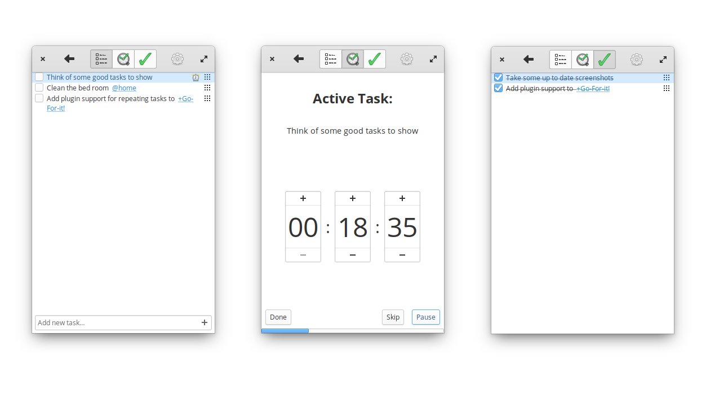

# _Go For It!_

## Information for End Users

_Go For It!_ is a simple and stylish productivity app, featuring a to-do list, merged with a timer that keeps your focus on the current task. More information for end users can be found [here](http://manuel-kehl.de/projects/go-for-it).

### How To

The following video explains the workflow of *Go For It!*:

### Storage and Synchronisation

To-do lists are stored in the [Todo.txt](http://todotxt.com/) format. This simplifies synchronization with mobile devices and makes it possible to edit tasks using other Todo.txt front-ends (e.g. the official apps for [Android](https://play.google.com/store/apps/details?id=com.todotxt.todotxttouch&hl=en) or [iOS](https://itunes.apple.com/us/app/todo.txt-touch/id491342186?ls=1&mt=8) or the alternative Android client [Simpletask](https://play.google.com/store/apps/details?id=nl.mpcjanssen.todotxtholo&hl=en)).
A comprehensive tutorial about setting up *Go For It!* with *Simpletask* can be found [here](http://itsfoss.com/go-for-it-to-do-app-in-linux/).

If you already use Todo.txt, **beware** of the fact, that *Go For It!* automatically archives completed tasks to the done list!

### Download and Installation

#### GNU/Linux Packages

##### elementary OS

##### Ubuntu

I maintain a [Launchpad PPA](https://launchpad.net/~go-for-it-team/+archive/ubuntu/go-for-it-daily) which can be used to acquire .deb packages. On Ubuntu (+ derivates) it is recommended to add the PPA for automatic updates:

    sudo add-apt-repository ppa:go-for-it-team/go-for-it-daily && sudo apt-get update
    sudo apt-get install go-for-it

##### Arch Linux

- [Arch Linux (Stable)](https://aur.archlinux.org/packages/go-for-it/)
- [Arch Linux (Git)](https://aur.archlinux.org/packages/go-for-it-git/)

Build it with `makepkg` or use your favorite [aur helper](https://wiki.archlinux.org/index.php/AUR_helpers).

##### Flatpak

[Flatpak](https://flatpak.org) packages support multiple distributions and are sandboxed.

Stable releases are hosted on [Flathub](https://flathub.org):

    flatpak remote-add --if-not-exists flathub https://flathub.org/repo/flathub.flatpakrepo
    flatpak install flathub de.manuel_kehl.go-for-it

#### Windows

Unfortunately, a recent Windows version isn't available. The https://github.com/mank319/Go-For-It/commits/windows-cmake branch may be a good starting point for porting the current version of _Go For It!_ to Windows.

#### Others

It should be fairly straightforward to compile _Go For It!_ on Unix-like platforms as long as Gtk+3, libnotify and cmake are available.
Should you run into any difficulties feel free to add an [issue](https://github.com/JMoerman/Go-For-It/issues).

## Information For Nerds

_Go For It!_ is free and open source software licensed under the GPLv3. It has been written in _Vala_ making heavy use of the _GTK_ framework.

The user interface is inspired by the design philosophy of [elementary OS](http://elementary.io/) and [Gnome](http://www.gnome.org/) applications, striving for elegant simplicity.

### Roadmap

- "to-do list only" mode
- Plugin support

### Potential Future Features

- time tracking functionality
    - option to make the timer count up
    - visualization and export of time tracking data
- mechanics for handling more complex projects
- support for different synchronization and storage backends

### How To Build
To build *Go For It!* you need to have the following software installed:

    valac >= 0.26
    cmake >= 2.8.9
    intltool
    gtk+-3.0 (>= 3.14)
    glib-2.0
    libnotify

Use the following commands in this order to build *Go For It!*:

    mkdir build
    cd build
    cmake -DCMAKE_INSTALL_PREFIX=/usr ..
    make
    sudo make install

Use the following commands to update the translation files:

    mkdir build
    cd build
    make pot
    make po

### Information for maintainers

CONFIGURING.md contains some information about the configuration flags specific to _Go For it!_.
